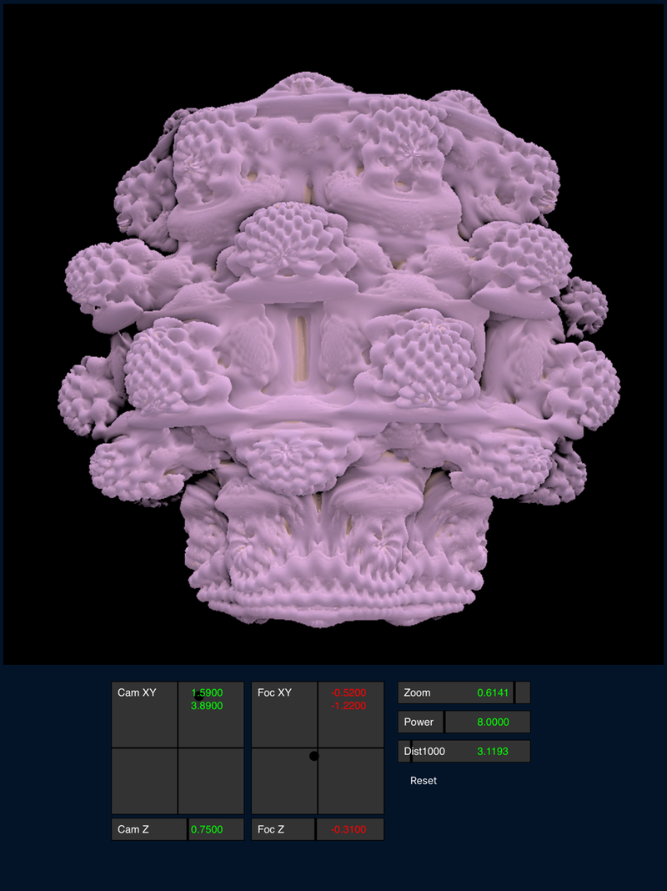

# RayMarchIOS
MandelBulb rendered with Ray Marching on IOS using Swift and Metal

Good beginner project to study Ray Marching when rendering a MandelBulb.
Metal compute shader uses various functions to render MandelBulb to a texture,
that Swift transfers to a UIImage for display.

